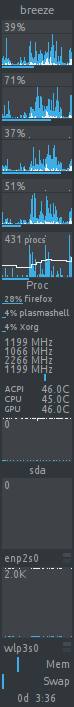
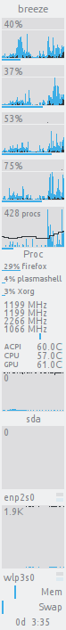

# Breeze GKrellM theme

Breeze GKrellM theme (Dark and Light variants) for integration with KDE Plasma 5

## Installation

1. Copy Breeze directory into $HOME/.gkrellm2/themes/
2. Select Breeze theme in GKrellM, choose variant (Dark=0 by default, Light=1)

## Screenshots

